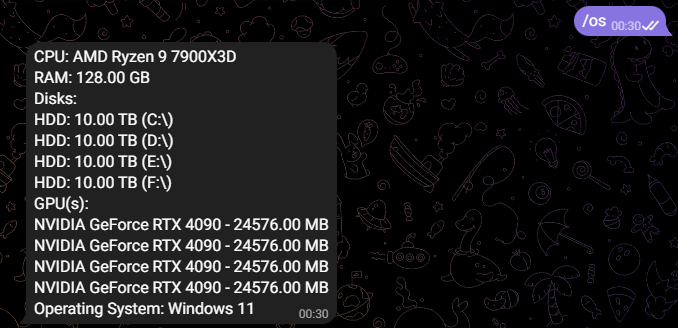
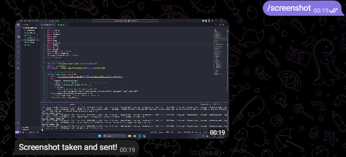

# Telegram Keylogger with System Info and Screenshot Features

## Project Overview

This Python-based project is a keylogger combined with a Telegram bot that allows remote control via specific commands. The keylogger logs key presses and sends the information to a specified Telegram chat once the log exceeds 50 characters. Additionally, the bot can gather system information, capture screenshots, and retrieve MAC addresses, IP addresses, and the current location based on the public IP address.

## Features

1. **Keylogger**: Captures all keystrokes and logs them into a file. Automatically sends the log file to the specified Telegram chat when the log exceeds 50 characters.
2. **Telegram Bot Commands**:
   - `/mac`: Retrieve the device's MAC address.
   - `/local_ip`: Retrieve the local IP address.
   - `/public_ip`: Retrieve the public IP address.
   - `/location`: Fetch the device's current location based on its public IP.
   - `/os`: Gather and send the system's OS information.
   - `/configuration`: Gather and send the system's detailed configuration (CPU, RAM, GPU, Disk)
   - `/screenshot`: Capture a screenshot and send it to the Telegram chat.
   - `/shutdown`: Shutdown victim's PC
3. **Remote Control**: Users can send commands to the bot via Telegram and receive real-time responses from the bot.
4. **Screenshot**: Capture the current screen and send the image to the Telegram chat upon receiving the `/screenshot` command.
5. **System Information**: The bot can retrieve detailed information about the system hardware, including CPU, RAM, disks, and GPUs, and send this information to the Telegram chat.

## Installation

### Prerequisites

- **Python 3.x**
- **Telegram Account**: You need to create a bot using [BotFather](https://core.telegram.org/bots#botfather) to get your `API_TOKEN`.
- **Telegram Chat ID**: You will need your chat ID to receive messages from the bot. You can retrieve your chat ID using the bot by visiting `https://api.telegram.org/bot<YOUR_API_TOKEN>/getUpdates` after sending a message to the bot.

### Required Libraries

Install all the necessary libraries for this project:

```bash
pip3 install -r requirements.txt
```

### Configuration

1. **API Token**:

   - First, create your Telegram bot using [BotFather](https://core.telegram.org/bots#botfather).
   - After completing the bot creation, you will receive an API token.
   - Open the project file and replace the `API_TOKEN` variable in the code with your bot's API token:
     ```python
     API_TOKEN = 'YOUR_TELEGRAM_BOT_API_TOKEN'
     ```
   - Example:
     ```python
     API_TOKEN = '1234567890:ABCdEfGhIjKlmNoPqRstUvWxYz123456789'
     ```

2. **Chat ID**:
   - To get your chat ID, send a message to your bot and open the following URL in your browser (replace `YOUR_API_TOKEN` with your bot's token):
     ```
     https://api.telegram.org/botYOUR_API_TOKEN/getUpdates
     ```
   - In the response, look for the `chat` field, which contains your `chat_id`. Replace the `CHAT_ID` variable in the code with this value:
     ```python
     CHAT_ID = 'YOUR_TELEGRAM_CHAT_ID'
     ```
   - Example:
     ```python
     CHAT_ID = '1234567890'
     ```

### Bot Commands

Once the script is running, you can control it via Telegram by sending the following commands to the bot:

- `/mac`: Get the MAC address of the device.
- `/local_ip`: Retrieve the local IP address of the machine running the bot.
- `/public_ip`: Get the public IP address of the device.
- `/location`: Fetch the device's current location based on its public IP address.
- `/os`: Get detailed system's OS information.
- `/os`: Get detailed system information such as CPU, RAM, disks, and GPUs.
- `/screenshot`: Take a screenshot of the current screen and send it to the Telegram chat.
- `/shutdown`: Shutdown victim's PC

### Example Output

#### Command: `/os`

When the `/os` command is sent, the bot will respond with the following detailed system information:

```yaml
CPU: AMD Ryzen 9 7900X3D
RAM: 128.00 GB
Disks:
HDD: 10.00 TB (C:\)
HDD: 10.00 TB (D:\)
HDD: 10.00 TB (E:\)
HDD: 10.00 TB (F:\)
GPU(s):
NVIDIA GeForce RTX 4090 - 24576.00 MB
NVIDIA GeForce RTX 4090 - 24576.00 MB
NVIDIA GeForce RTX 4090 - 24576.00 MB
NVIDIA GeForce RTX 4090 - 24576.00 MB
Operating System: Windows 11

```



#### Command: `/screenshot`

The bot will capture the current screen and send a screenshot image directly to the Telegram chat.



## Security and Privacy

This project is intended for educational purposes and should not be used without proper authorization. Unauthorized use of keyloggers or system information gathering without consent is illegal and unethical.

## License

This project is licensed under the MIT License. See the [LICENSE](LICENSE) file for details.

## Acknowledgments

- **Python Telegram Bot API**: For enabling Telegram bot functionality.
- **Psutil**: For system information retrieval.
- **Pynput**: For keylogging functionality.
- **Pillow**: For screenshot functionality.

## Author: meli0das

## Contact: nguyenvietkhoi.work@gmail.com

### Explanation

- **Overview**: Introduces the main functionality of the project.

- **Features**: Lists the main functions such as keylogger, Telegram bot, and supported commands.

- **Installation**: Provides detailed instructions on how to install and configure the project.

- **Bot Commands**: Lists the commands to control the bot via Telegram and examples of the output results.

- **Security and Privacy**: Notes on security and privacy concerns.

- **License & Acknowledgments**: Information about the license and the tools/libraries used.
